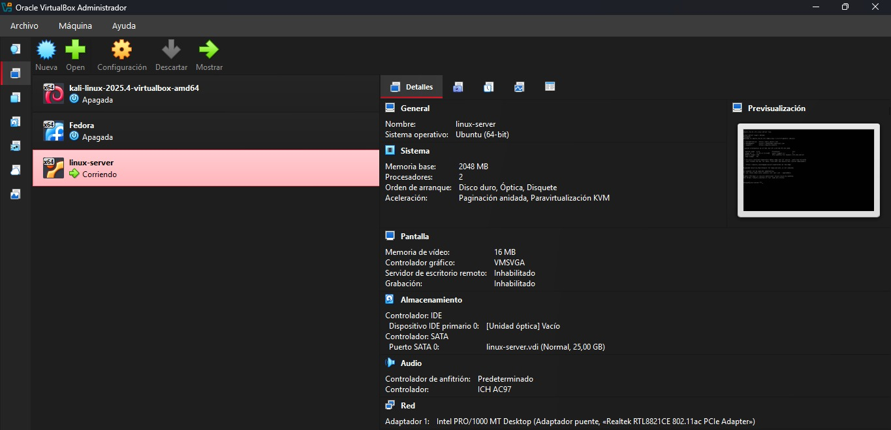
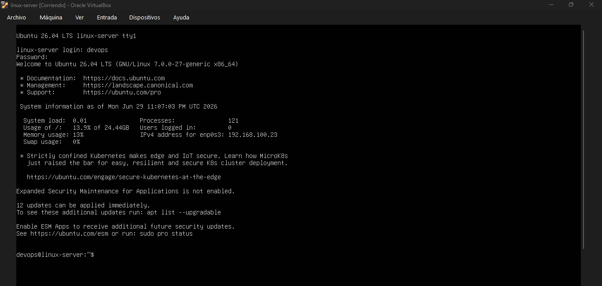
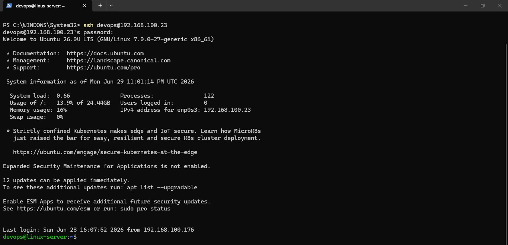

# Server Setup

## Objetivo

Instalar y configurar un servidor Ubuntu Server desde cero
en una máquina virtual, dejándolo listo para administración remota.

## Entorno

| Parámetro | Valor |
|-----------|-------|
| Hypervisor | VirtualBox 7.x |
| OS | Ubuntu Server 24.04 LTS |
| RAM | 4096 MB |
| Disco | 25 GB |
| Red | Adaptador puente |
| Usuario | devops |

## Tareas completadas

- [x] Crear máquina virtual en VirtualBox
- [x] Instalar Ubuntu Server 26.04 LTS
- [x] Configurar usuario `devops`
- [x] Cambiar hostname a `linux-server`
- [x] Actualizar paquetes del sistema
- [x] Habilitar OpenSSH durante la instalación
- [x] Conectarse remotamente por SSH

## Comandos aprendidos

| Comando | Descripción |
|---------|-------------|
| `uname -a` | Información del sistema operativo |
| `df -h` | Uso del disco |
| `free -h` | Uso de RAM |
| `ip addr show` | Ver dirección IP |
| `sudo apt update && sudo apt upgrade -y` | Actualizar paquetes |
| `hostnamectl set-hostname nombre` | Cambiar hostname |
| `ssh usuario@ip` | Conectarse por SSH |

## Problema encontrado

Durante la instalación, la red no tomó IP automáticamente.
Solución: verificar que el adaptador esté en modo Bridge
y no NAT en la configuración de VirtualBox.

## Evidencia

### VM creada en VirtualBox

### Primer login en el servidor

### Conexión SSH desde PC local

## Lo que se aprendio

SSH es el estándar para administrar servidores en producción.
Nadie entra directamente a la pantalla del servidor.
El modo Bridge en VirtualBox es clave para simular una red real.
