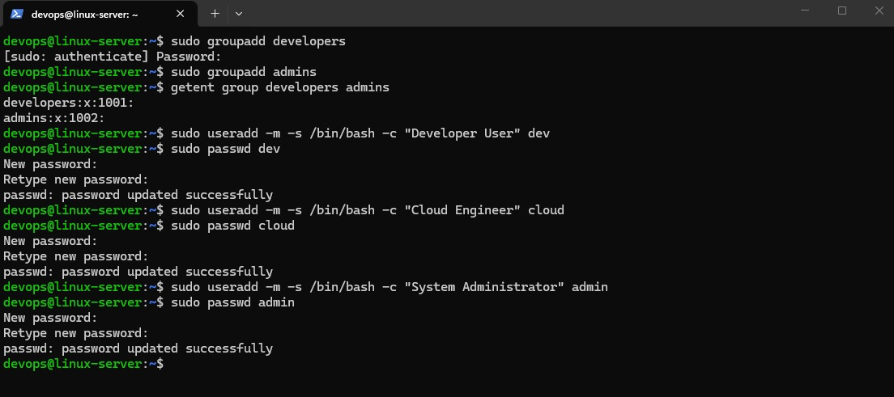
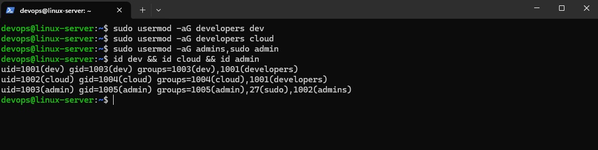
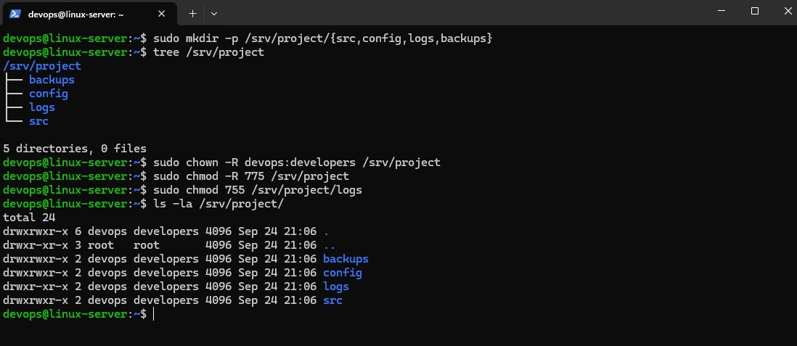
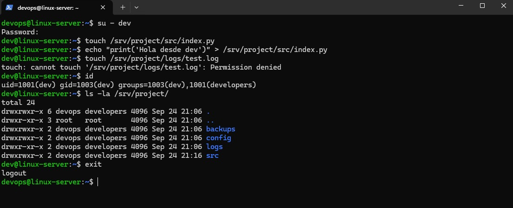
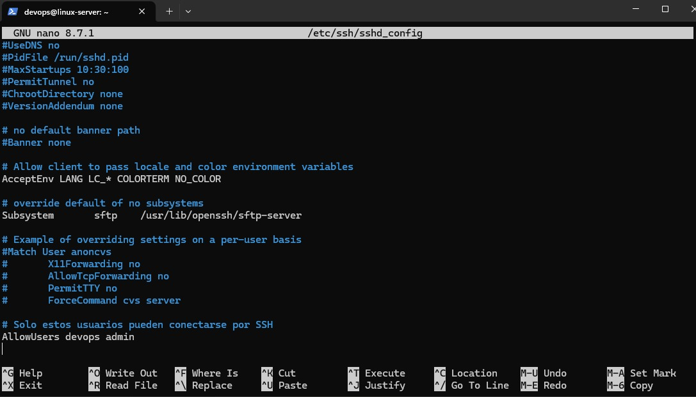
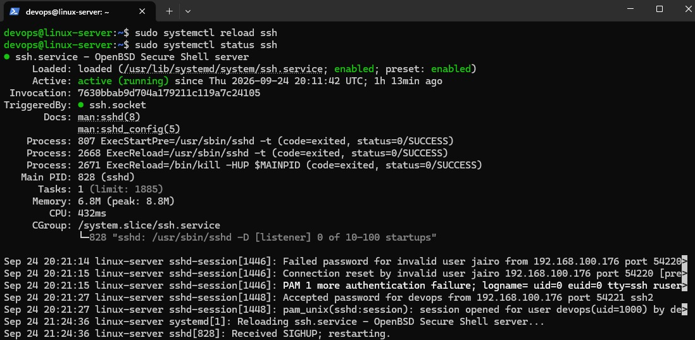
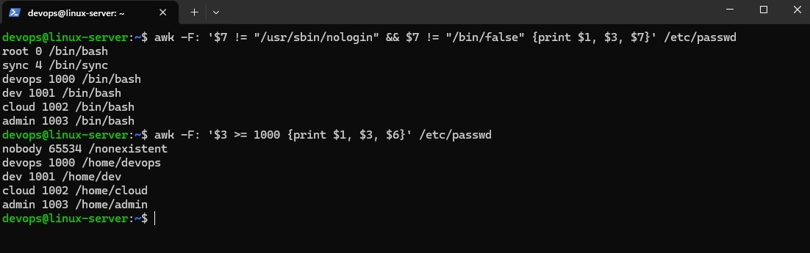

# V02 — User Management

## Escenario

El cliente necesita configurar accesos para su equipo en el servidor.
Tres roles diferentes, cada uno con permisos distintos sobre
los archivos del proyecto.

## Objetivo

Crear la estructura de usuarios, grupos y permisos de `/srv/project`
para que el equipo trabaje en el mismo proyecto sin pisarse,
y restringir el acceso SSH a los perfiles de administración.

## Tareas completadas

- [x] Crear los grupos `developers` y `admins`
- [x] Crear los usuarios `dev`, `cloud` y `admin` con su directorio home
- [x] Asignar grupos secundarios con `usermod -aG`
- [x] Crear la estructura `/srv/project/` con `src/`, `config/`, `logs/` y `backups/`
- [x] Aplicar permisos 775 y activar el bit SGID en `src/`
- [x] Verificar que `dev` no tiene sudo y `admin` sí
- [x] Restringir el acceso SSH con `AllowUsers` y confirmar que el servicio sigue activo
- [x] Listar los usuarios reales del sistema con `awk`

## Usuarios configurados

| Usuario | Grupo principal | Grupos secundarios | Sudo | Rol |
|---------|----------------|-------------------|------|-----|
| dev | dev | developers | No | Desarrollador |
| cloud | cloud | developers | No | Cloud Engineer |
| admin | admin | admins, sudo | Sí | Administrador |

> `devops` es la cuenta base creada en [V01 Server Setup](../server-setup/README.md).
> No forma parte de esta versión, pero es la dueña de `/srv/project/`
> y mantiene acceso por SSH como administrador del servidor.

## Estructura de directorios creada

`/srv` es la ruta reservada en la jerarquía FHS para los datos
específicos de los servicios del sistema. `/srv/project/` organiza
el proyecto del cliente dentro de ese estándar.

```text
/srv/project/                 chown devops:developers
├── src/                     grupo developers, SGID activado
├── config/                  grupo developers
├── logs/                    solo el dueño puede escribir
└── backups/                 grupo developers
```

## Permisos aplicados

| Directorio | Permisos | Significado |
|------------|----------|-------------|
| `/srv/project/` | 775 + `chown devops:developers` | Grupo puede leer y escribir |
| `/srv/project/src/` | 775 + SGID (`chmod g+s`) | Archivos heredan grupo `developers` |
| `/srv/project/logs/` | 755 | Solo el dueño escribe |

## Comandos clave aprendidos

| Comando | Descripción |
|---------|-------------|
| `useradd -m -s /bin/bash -c "comentario" user` | Crear usuario modo producción |
| `getent passwd usuario` | Info completa del usuario |
| `getent group grupo` | Info completa del grupo |
| `id usuario` | UID, GID y grupos del usuario |
| `usermod -aG grupo1,grupo2 usuario` | Asignar múltiples grupos |
| `chown -R usuario:grupo directorio` | Cambiar dueño recursivo |
| `chmod -R 775 directorio` | Permisos recursivos |
| `chmod g+s directorio` | Activar SGID |
| `awk -F: '$3 >= 1000' /etc/passwd` | Listar usuarios reales |

## Diferencia entre adduser y useradd

`adduser` es interactivo y amigable, ideal para aprender.
`useradd` es el comando de bajo nivel, más rápido y usado
en scripts de automatización en producción.

## Verificación de privilegios sudo

Los permisos de `sudo` no se aplican en el momento. El usuario tiene que
cerrar la sesión y volver a entrar para que el sistema relea sus grupos
actualizados. La captura de evidencia confirma que `dev` recibe
`dev is not in the sudoers file` mientras que `admin` sí opera
como administrador.

## Restricción SSH aplicada

Solo `devops` (cuenta base) y `admin` pueden conectarse por SSH.
Configurado en `/etc/ssh/sshd_config` con la directiva `AllowUsers`.

Esto evita que los usuarios de solo trabajo (`dev` y `cloud`)
tengan acceso remoto al servidor.

## Lo que aprendí

El SGID en directorios resuelve uno de los problemas más
comunes en equipos: que los archivos creados por diferentes
usuarios tengan permisos inconsistentes. En lugar de arreglar
permisos manualmente, el bit SGID lo hace automáticamente.

La restricción de SSH por usuario es una de las primeras
cosas que se configura en servidores de producción.

Un detalle que costó tiempo: dar de alta a un usuario en el grupo
`sudo` no activa el privilege en la sesión actual. Hay que
reconectarse, y por eso conviene verificar con una sesión nueva
y no asumir que el comando falló.

## Evidencia

### Grupos y usuarios creados




### Estructura de directorios y permisos



### Privilegios sudo



### Seguridad SSH




### Administración


